# Heart Disease Prediction: End-to-End MLOps Report

**Name:** Mohammad Saqib S. Koti
**Roll No:** 2024AD05127

**Course:** Machine Learning Operations (MLOps), AIMLCZG523
**Assignment:** 01, End-to-End ML Model Development, CI/CD & Production Deployment
**Dataset:** Heart Disease UCI (Cleveland), UCI Machine Learning Repository

---

## 1. Project Overview

This project delivers a complete, reproducible MLOps pipeline that predicts the
risk of heart disease from patient clinical data and serves it as a monitored,
cloud-ready REST API. It covers the full lifecycle: data acquisition, EDA,
feature engineering, model development with experiment tracking, packaging,
automated testing & CI/CD, containerization, Kubernetes deployment, and
monitoring.

**Problem type:** binary classification (0 = no heart disease, 1 = disease present).

**End-to-end pipeline flow:**

```
Data & modelling:
  UCI Heart Disease dataset (download_data.py)
    -> EDA + cleaning (ColumnTransformer: impute, scale, one-hot encode)
    -> Model training (Logistic Regression / Random Forest / XGBoost, GridSearchCV + 5-fold CV)
    -> MLflow tracking (params, metrics, confusion-matrix & ROC plots, models)
    -> Model artifact (.joblib pipeline + model_metadata.json)

CI/CD (GitHub Actions):
  flake8 lint -> pytest -> train model -> build & smoke-test Docker image

Serving & deployment:
  Docker image (FastAPI + trained model)
    -> FastAPI service (/predict, /health, /metrics, /docs)
    -> Kubernetes (Deployment + Service, exposed via LoadBalancer / Ingress)
    -> Client (curl / Postman / Swagger UI)

Monitoring:
  FastAPI /metrics -> Prometheus (scrape) -> Grafana (dashboards)
```

---

## 2. Data Acquisition & Exploratory Data Analysis (Task 1)

### 2.1 Acquisition
The dataset is obtained programmatically by `data/download_data.py`, which uses
the official `ucimlrepo` package (dataset id = 45) with a direct-HTTP fallback
to `processed.cleveland.data`. The raw file has **303 patients** and **14
columns** (13 clinical features + a 0-4 diagnosis column `num`).

### 2.2 Cleaning & preprocessing
* `?` placeholders are coerced to `NaN`. Only **`ca`** and **`thal`** contain
  missing values (a few rows each), which are median-imputed.
* The 0-4 diagnosis `num` is converted to a **binary target** (num > 0 becomes 1).
* Numeric features are standard-scaled; categorical clinical codes are one-hot
  encoded (inside the sklearn pipeline, so it is reused at inference).

### 2.3 EDA findings
| Visualization | File | Insight |
|---|---|---|
| Missing-value map | `screenshots/eda_missing_values.png` | Only `ca`, `thal` missing |
| Class balance | `screenshots/eda_class_balance.png` | ~54% / 46%, no severe imbalance |
| Histograms | `screenshots/eda_histograms.png` | Features on very different scales, scaling needed |
| Correlation heatmap | `screenshots/eda_correlation_heatmap.png` | `cp`, `oldpeak`, `exang`, `ca`, `thal` most predictive; `thalach` negatively correlated |
| Numeric vs target | `screenshots/eda_numeric_vs_target.png` | Disease patients reach lower max heart rate, higher `oldpeak` |
| Categorical vs target | `screenshots/eda_categorical_vs_target.png` | Chest-pain type and exercise-induced angina strongly separate classes |

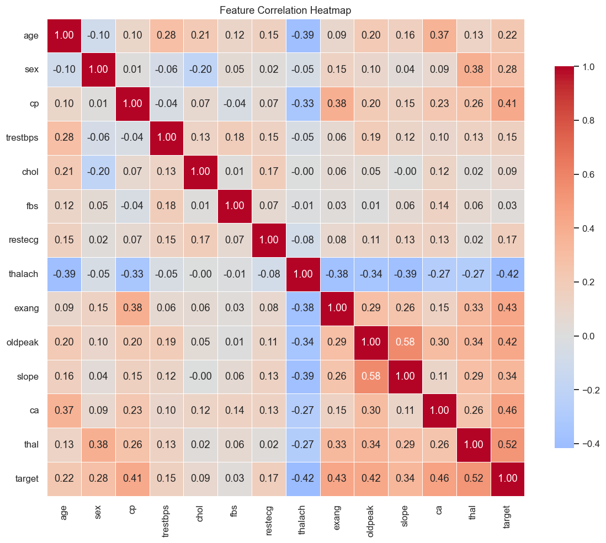

*Figure 2: Feature correlation heatmap.*

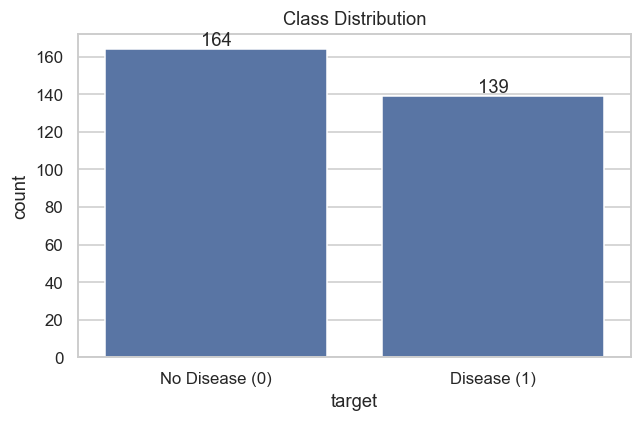

*Figure 3: Target class distribution.*

---

## 3. Feature Engineering & Model Development (Task 2)

### 3.1 Feature pipeline
A scikit-learn `ColumnTransformer` inside a `Pipeline`:
* **Numeric** (`age, trestbps, chol, thalach, oldpeak`): median impute, then `StandardScaler`.
* **Categorical** (`sex, cp, fbs, restecg, exang, slope, ca, thal`): most-frequent
  impute, then `OneHotEncoder(handle_unknown="ignore")`.

### 3.2 Models, tuning & evaluation
Three classifiers were trained with **`GridSearchCV`** (5-fold Stratified CV,
scoring = ROC-AUC) and evaluated on a stratified 20% hold-out test set.

| Model | Accuracy | Precision | Recall | F1 | ROC-AUC | CV ROC-AUC |
|-------|:--------:|:---------:|:------:|:--:|:-------:|:----------:|
| Logistic Regression (selected) | 0.885 | 0.839 | 0.929 | 0.881 | 0.966 | 0.902 |
| Random Forest | 0.885 | 0.839 | 0.929 | 0.881 | 0.955 | 0.898 |
| XGBoost | 0.902 | 0.867 | 0.929 | 0.897 | 0.931 | 0.870 |

**Model selection:** Logistic Regression is chosen as the production model. It
has the **highest ROC-AUC (0.966)** and best cross-validated AUC (0.902), while
being the simplest and most interpretable. High recall (0.93) is important
clinically, since it means few missed disease cases.

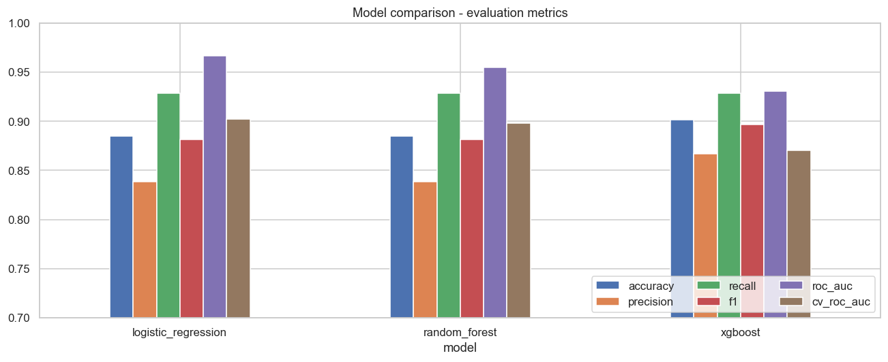

*Figure 4: Model comparison across metrics.*

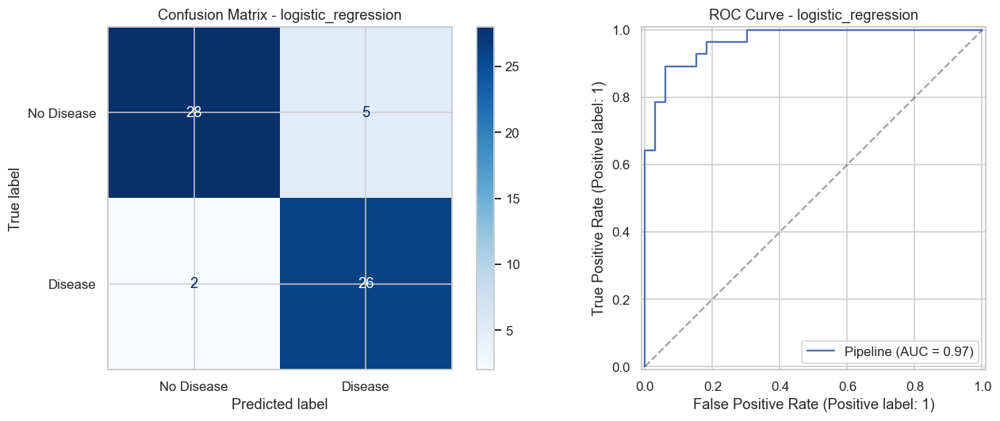

*Figure 5: Confusion matrix and ROC curve for the selected model.*

---

## 4. Experiment Tracking (Task 3)

**MLflow** tracks every run under the experiment `heart-disease-classification`.
For each model we log:
* Parameters: model type and best hyper-parameters from GridSearchCV.
* Metrics: accuracy, precision, recall, F1, ROC-AUC, CV ROC-AUC.
* Artifacts: confusion-matrix and ROC-curve PNGs.
* The serialized sklearn model.

Launch the UI with `mlflow ui --backend-store-uri ./mlruns` and open
http://localhost:5000.

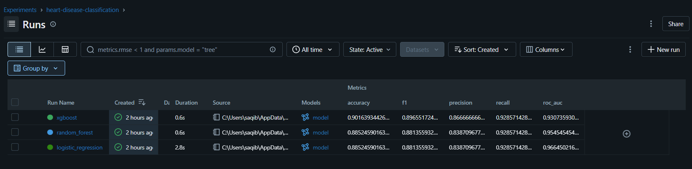

*Figure 6: MLflow experiment runs and logged metrics for all three models.*

The confusion-matrix and ROC-curve artifacts logged with each run are shown
below.

| Logistic Regression | Random Forest | XGBoost |
|:---:|:---:|:---:|
| 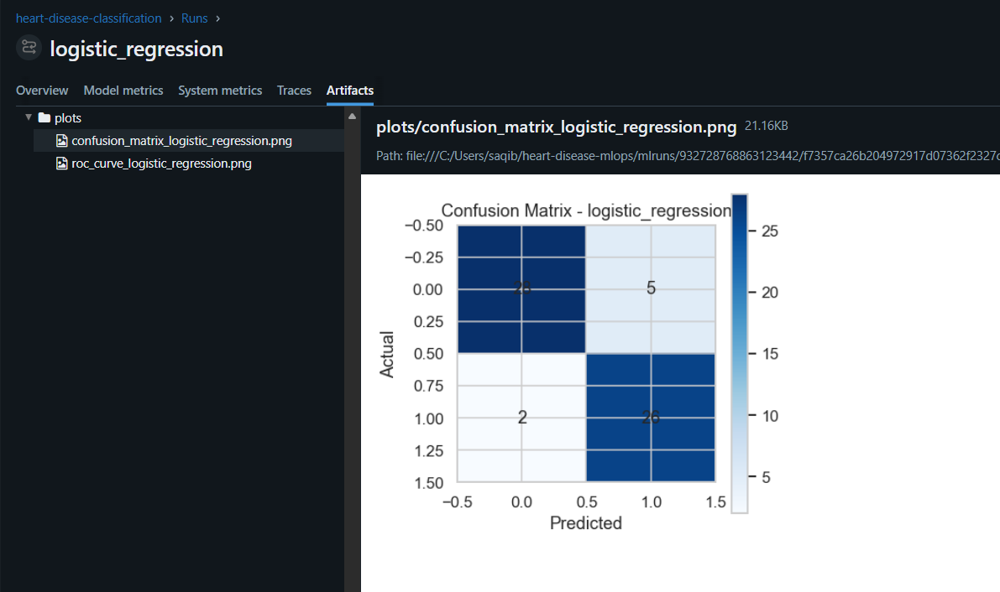 | 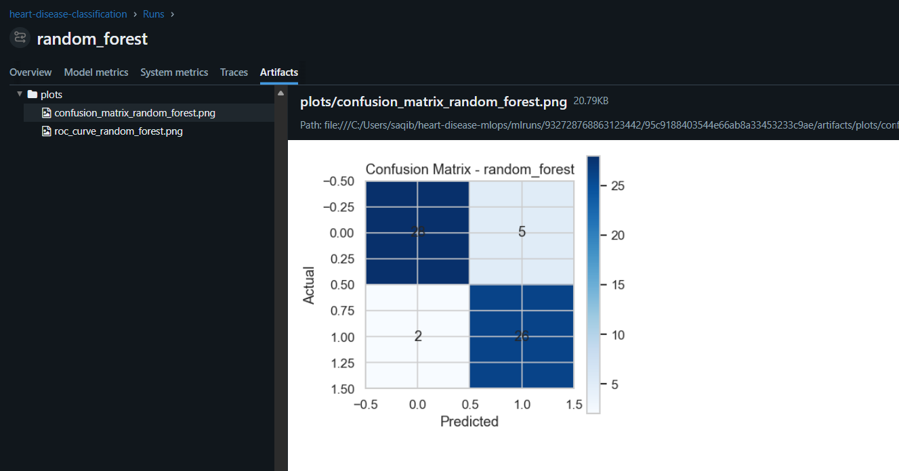 | 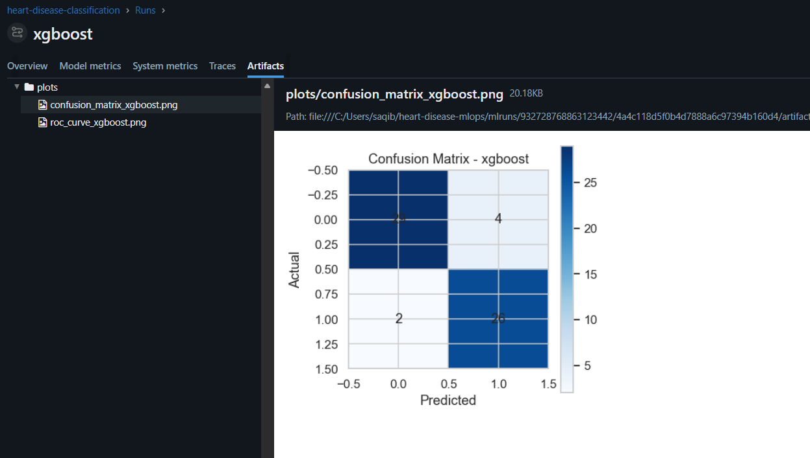 |
| 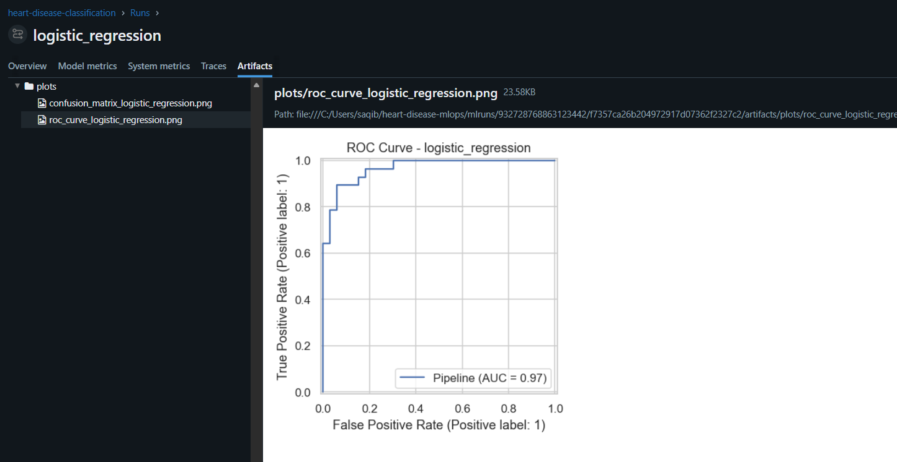 | 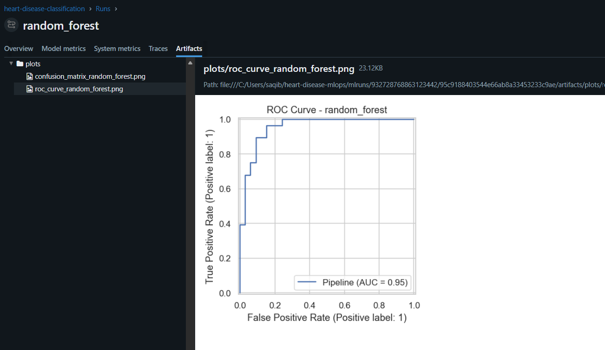 | 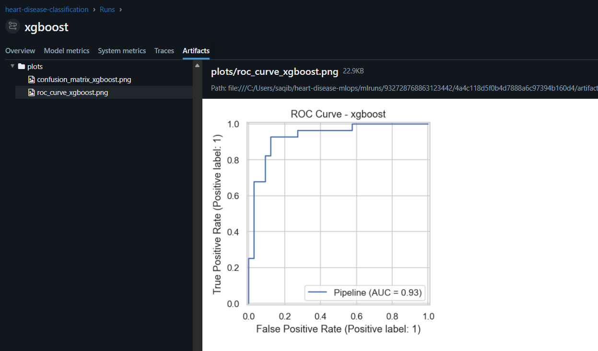 |

*Figure 6a: Confusion matrix (top) and ROC curve (bottom) logged as MLflow
artifacts for each model.*

---

## 5. Model Packaging & Reproducibility (Task 4)

* The winning **Pipeline** (preprocessing + model) is serialized with `joblib`
  to `models/heart_disease_model.joblib`; `models/model_metadata.json` stores
  the chosen model, hyper-parameters, metrics and training timestamp.
* Because preprocessing lives inside the pipeline, inference requires only the
  single artifact, guaranteeing train/serve parity.
* Dependencies are pinned in `requirements.txt` (full) and `requirements-api.txt`
  (slim serving set). A fixed `RANDOM_STATE = 42` makes runs reproducible.

---

## 6. CI/CD Pipeline & Automated Testing (Task 5)

**GitHub Actions** (`.github/workflows/ci.yml`) runs four sequential jobs. The
pipeline **fails fast** on any lint or test error:

1. **lint:** `flake8` (fails on syntax/undefined-name errors).
2. **test:** `pytest` (data, model & API tests); uploads JUnit results.
3. **train:** trains the model, uploads `trained-model` and `mlflow-runs`
   artifacts.
4. **docker-build:** builds the image, runs the container and smoke-tests
   `/health` + `/predict`.

Local test run: **13 passed** (`python -m pytest -v`).

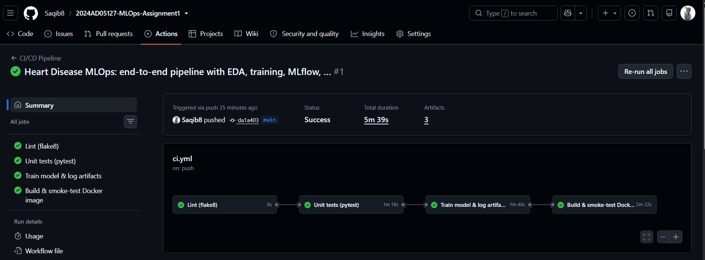

*Figure 7: GitHub Actions pipeline with the four jobs passing.*

---

## 7. Model Containerization (Task 6)

* `Dockerfile` uses `python:3.12-slim`, installs `requirements-api.txt`, copies
  `src/`, `api/` and the trained `models/`, runs as a **non-root** user with a
  `/health` HEALTHCHECK, and serves with uvicorn on port 8000.
* The `/predict` endpoint accepts JSON patient features and returns the
  prediction, label, confidence and disease probability. Tested via the FastAPI
  Swagger UI (`/docs`): a `POST /predict` returns HTTP 200 with
  `{"prediction":0, "label":"No heart disease", "confidence":0.8146,
  "probability_disease":0.1854}` (served by uvicorn).

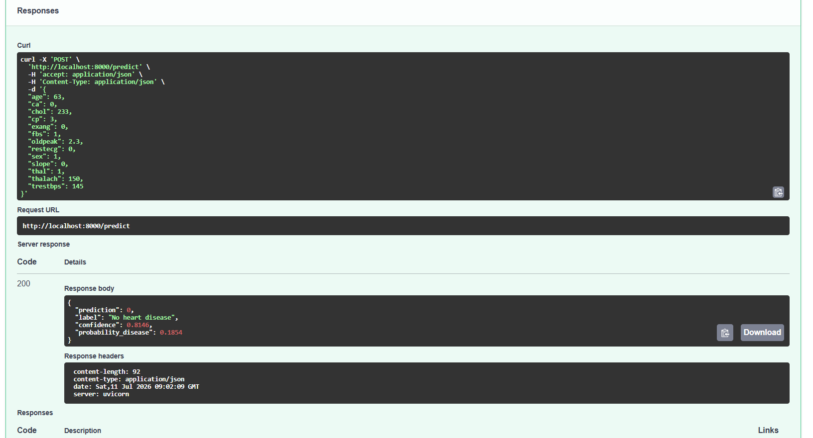

*Figure 8: Successful `POST /predict` response (HTTP 200) via the API Swagger UI,
returning prediction and confidence.*

The same application is containerized with Docker for isolated, reproducible
serving:

```bash
docker build -t heart-disease-api .
docker run -p 8000:8000 heart-disease-api
```

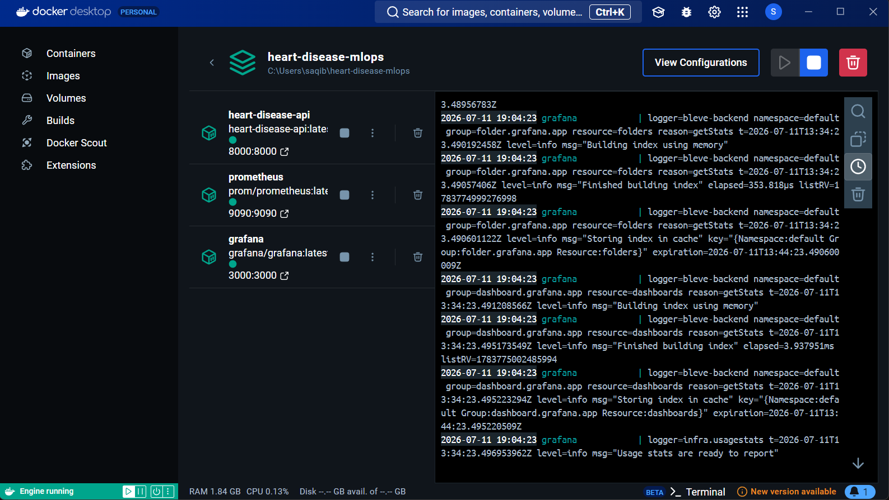

*Figure 9: Docker image build and container run serving the same API.*

---

## 8. Production Deployment (Task 7)

Kubernetes manifests in `k8s/`:
* `deployment.yaml`: 2 replicas, resource requests/limits, liveness & readiness
  probes on `/health`, Prometheus scrape annotations.
* `service.yaml`: `LoadBalancer` exposing port 80 to container 8000.
* `ingress.yaml`: optional NGINX ingress (`heart-disease.local`).
* `hpa.yaml`: Horizontal Pod Autoscaler (2 to 5 replicas at 70% CPU).

Deployed on Minikube / Docker Desktop Kubernetes (see README section 7).

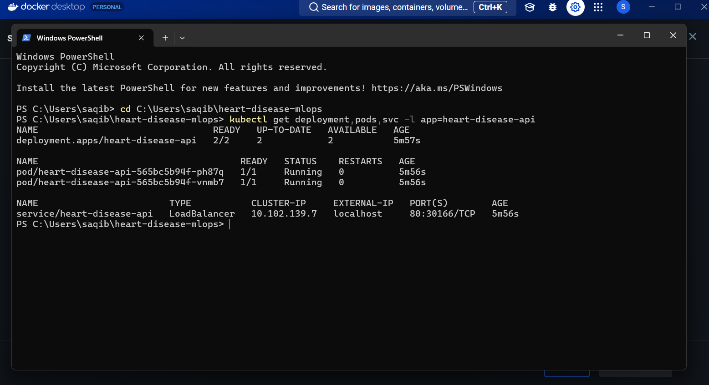

*Figure 10: kubectl get pods,svc and a prediction against the exposed service.*

---

## 9. Monitoring & Logging (Task 8)

* **Logging:** every request/response is logged by the FastAPI app (structured
  stdout logs, container-friendly).
* **Metrics:** `/metrics` exposes Prometheus counters/histograms:
  `api_requests_total`, `heart_predictions_total`, `predict_latency_seconds`.
* **Prometheus** scrapes the API; **Grafana** loads a pre-provisioned dashboard
  (`Heart Disease API Monitoring`) with request rate, prediction counts by
  class, and p50/p95 latency panels. All wired via `docker-compose.yml`.

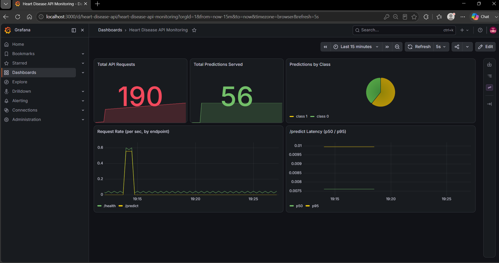

*Figure 11: Grafana dashboard and Prometheus targets.*

---

## 10. Setup / Install Instructions

See `README.md` for full commands. Summary:
```bash
pip install -r requirements.txt        # 1. environment
python data/download_data.py           # 2. data
python -m src.train                    # 3. train + MLflow
python -m pytest -v                    # 4. tests
uvicorn api.main:app --port 8000       # 5. serve (or docker compose up)
```

---

## 11. Repository & Deliverables

* **Repository:** https://github.com/Saqib8/2024AD05127-MLOps-Assignment1
* **Deployed API:** local Kubernetes / Docker (access via README sections 4 & 7)

### Deliverables checklist
- [x] Code, Dockerfile(s), requirements files
- [x] Cleaned dataset + download script
- [x] Notebooks (EDA, training, inference)
- [x] `tests/` with unit + API tests
- [x] GitHub Actions workflow YAML
- [x] Kubernetes manifests
- [x] Monitoring (Prometheus + Grafana)
- [x] Architecture diagram + report
- [ ] Screenshots (MLflow, CI, Docker, K8s, Grafana)
- [ ] Short pipeline video
